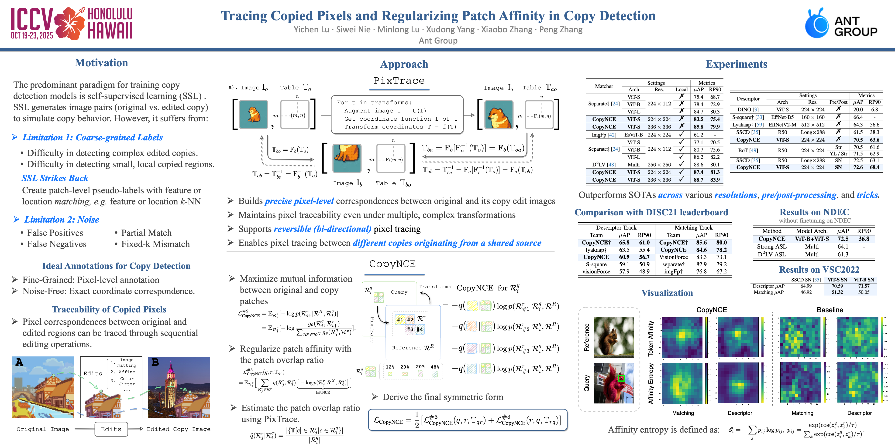
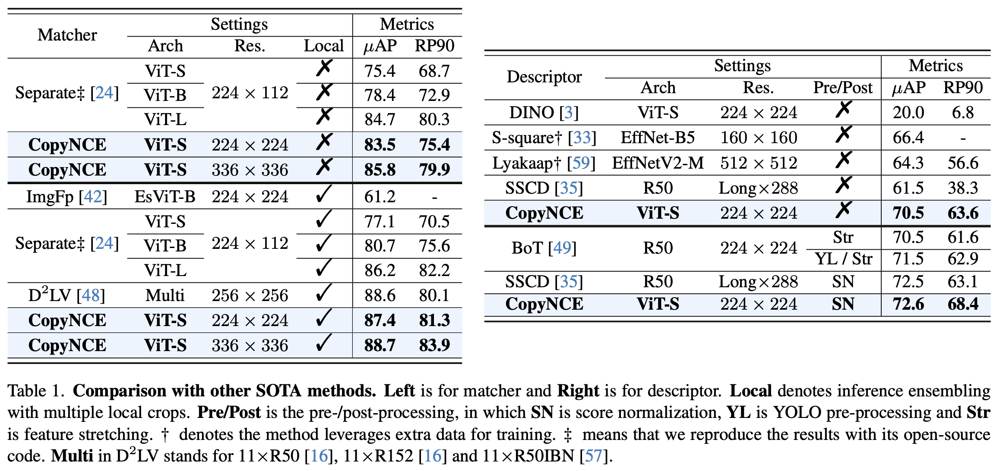

# Tracing Copied Pixels and Regularizing Patch Affinity in Copy Detection

Yichen Lu, Siwei Nie, Minlong Lu, Xudong Yang, Xiaobo Zhang, Peng Zhang 

[[Paper](https://arxiv.org/abs/2602.17484)]
[[Slide](https://iccv.thecvf.com/media/iccv-2025/Slides/828_8JhyCpe.pdf)]
[[Poster](https://iccv.thecvf.com/media/PosterPDFs/ICCV%202025/828.png?t=1759750504.1346169)]
[[Youtube](https://youtu.be/M9c1eCP2k7M)]
[[Citation](#citation)]

Image Copy Detection (ICD) aims to identify manipulated content between image 
pairs through robust feature representation learning. While self-supervised 
learning (SSL) has advanced ICD systems, existing view-level contrastive 
methods struggle with sophisticated edits due to insufficient fine-grained 
correspondence learning. We address this limitation by exploiting the 
inherent geometric traceability in edited content through two key innovations. 
First, we propose PixTrace - a pixel coordinate tracking module that maintains 
explicit spatial mappings across editing transformations. Second, we introduce 
CopyNCE, a geometrically-guided contrastive loss that regularizes patch 
affinity using overlap ratios derived from PixTrace's verified mappings. 
Our method bridges pixel-level traceability with patch-level similarity 
learning, suppressing supervision noise in SSL training. Extensive experiments 
demonstrate not only state-of-the-art performance (88.7% $\mu$AP / 83.9% RP90 
for matcher, 72.6% $\mu$AP / 68.4% RP90 for descriptor on DISC21 dataset) 
but also better interpretability over existing methods.



## Key files

```
# configs
core/configs/descriptor_default_config.yaml     - default config file of descriptor
core/configs/matching_default_config.yaml       - default config file of matcher

# PixTrace-related
core/data/augmentation/mask_mapper.py           - implementation of PixTrace, including pixel tracking (copy vs original and copy vs copy) and reverse operation
core/data/augmentation                          - implementation of various augmentations 

# CopyNCE-related
core/loss/copynce_loss.py                       - implementation of CopyNCE loss

# eval-related entry
scripts/eval
```

## Models



| Model Type | Arch  | Resolution | Fine-tuned | uAP  | RP90 |                                            Checkpoint                                             | 
|:-----------|:-----:|:----------:|:----------:|:----:|:----:|:-------------------------------------------------------------------------------------------------:|
| Descriptor | ViT-S |  224x224   |     ❌      | 70.5 | 63.6 | [download](https://drive.google.com/file/d/1fWChrrOovX8JOcNNCgrj6liXR2L8yKEu/view?usp=drive_link) |
| Matcher    | ViT-S |  224x224   |     ❌      | 83.5 | 75.4 | [download](https://drive.google.com/file/d/1g6bAUTfyEXR20bUbEtHH_i5NBfrbDYHq/view?usp=drive_link) |

We sincerely apologize for the omission of model weights with other configurations. 
Due to our company's extremely complex open-source release process for code and 
model weights, we are currently only able to publicly release the two base checkpoints 
shared during the paper review phase. To mitigate this limitation, we have included 
detailed scripts of training, fine-tuning, and evaluation for models with other configurations.

## Preparation

### Build Environment

The results of CopyNCE reported in the paper were all obtained with the environment of 
Python 3.8 and PyTorch 2.1. To ensure reproducibility, we recommend following the script 
below to set up your training and inference environment.

[pip](https://pip.pypa.io/en/stable/getting-started/) - Build the environment with ``requirements.txt``
```bash
pip install -r requirements.txt
```

[conda](https://www.anaconda.com/docs/getting-started/miniconda/main) - Build and manage the environment in 
Anaconda / Miniconda with the provided environment definition.
```bash
conda env create -f conda.yaml
conda activate copynce
```

### Prepare Datasets
[DISC21](https://ai.meta.com/datasets/disc21-dataset/) is introduced as the dataset of 
Image Similarity Challenge at NeurIPS’21 and has gained its popularity in ICD. And main experiments 
in our paper were conducted on DISC21. To reproduce the results in our paper, please make sure the folder
structure of this dataset is as follows:
```text
CopyNCE
|--datasets
|  |--DISC21
|     |--query_images
|     |  |--Q00000.jpg
|     |  |--... (100k images in total)
|     |--reference_images
|     |  |--R000000.jpg
|     |  |--... (1M images in total)
|     |--training_images
|        |--T000000.jpg
|        |--... (1M images in total)
|--assets
|--core
|--... (other folders)
```

### Download pretrained models
Download the descriptor and matcher models in [Models](#models) section, and move them into ``weights`` 
folder as follows:
```text
CopyNCE
|--weights
|  |--descriptor_vits_224.pth.tar
|  |--matcher_vits_224.pth.tar
|--assets
|--core
|--... (other folders)
```

### (Optional) Generate extra weights
If you expect to undergo the training or fine-tuning process and reproduce the results in the paper, you should follow 
the steps to generate extra weights necessary in training.

**Pretrain weights from DINO**
Download the DINO pretrained ViT-S and ViT-B model weights.
```bash
# pwd = /path/to/project/root
# please make sure that 'weights' folder has been made in the root path of this project

# download ViT-S
wget -O weights/dino_deitsmall16_pretrain.pth https://dl.fbaipublicfiles.com/dino/dino_deitsmall16_pretrain/dino_deitsmall16_pretrain.pth
# download ViT-B
wget -O weights/dino_vitbase16_pretrain.pth https://dl.fbaipublicfiles.com/dino/dino_vitbase16_pretrain/dino_vitbase16_pretrain.pth
```

**Modify DINO pretrained weights**
```bash
# pwd = /path/to/project/root
# modify ViT-S weights for descriptor to load
python scripts/run/modify_dino_weights.py --layers 12 --encoder-layers 12 --weights-path weights/dino_deitsmall16_pretrain.pth --output-path weights/dino_vits16_enc-12.pth

# modify ViT-B weights for descriptor to load
python scripts/run/modify_dino_weights.py --layers 12 --encoder-layers 12 --weights-path weights/dino_vitbase16_pretrain.pth --output-path weights/dino_vitb16_enc-12.pth

# modify ViT-S weights for matcher to load
python scripts/run/modify_dino_weights.py --layers 12 --encoder-layers 8 --weights-path weights/dino_deitsmall16_pretrain.pth --output-path weights/dino_vits16_enc-8_fus-4.pth

# interpolate ViT-S position embedding for matcher to train on 336x336
python scripts/run/modify_dino_weights.py --layers 12 --encoder-layers 8 --weights-path weights/dino_deitsmall16_pretrain.pth --output-path weights/dino_vits16_enc-8_fus-4.pth
```

**Generate k-NN matrix**
```bash
# extract dino features on ISC training set
bash scripts/run/extract_dino_features.sh isc dev/vits_lin.yaml dino_vits_isc_train.pth

# generate intra k-NN matrix of training set
python scripts/run/build_knn.py \
  --query-feature-path outputs/dino/eval/dino_vits_isc_train.pth \
  --reference-feature-path outputs/dino/eval/dino_vits_isc_train.pth \
  --output-path weights/dino_vits_isc_knn.pth \
  --k 128

# (optional) generate k-NN matrix between dev set I and reference set for fine-tuning
# extract dino features on ISC dev set I
bash scripts/run/extract_dino_features.sh isc_query_val dev/vits_lin.yaml dino_vits_isc_val.pth

# extract dino features on ISC reference set
bash scripts/run/extract_dino_features.sh isc_reference dev/vits_lin.yaml dino_vits_isc_reference.pth

# generate k-NN matrix between dev set I and reference set
python scripts/run/build_knn.py \
  --query-feature-path outputs/dino/eval/dino_vits_isc_val.pth \
  --reference-feature-path outputs/dino/eval/dino_vits_isc_reference.pth \
  --output-path weights/dino_vits_isc_val-to-ref_knn.pth \
  --k 128
```

## Training
Before launching training process, please make sure that following weights generated in Section 
[Preparation](#optional-generate-extra-weights) are ready:
1. DINO pretrained weights: ``weights/dino_vits16_enc-12.pth`` or ``weights/dino_vitb16_enc-12.pth`` or 
``weights/dino_vits16_enc-8_fus-4.pth`` or ``weights/dino_vits16_enc-8_fus-4.pth`` (depends on which 
model trained under which settings).
2. k-NN matrix for global hard negative mining: ``weights/dino_vits_isc_knn.pth``

```bash
# pwd = /path/to/project/root
# train ViT-S descriptor from DINO pretrained weights on 224x224 resolution and evaluate on DISC21 dev set II
bash scripts/train/train_des.sh copynce_descriptor weights/dino_vits16_enc-12.pth copynce.yaml dev/vits_lin.yaml
# train ViT-B descriptor from DINO pretrained weights on 224x224 resolution and evaluate on DISC21 dev set II
bash scripts/train/train_des.sh copynce_descriptor_vitb weights/dino_vitb16_enc-12.pth copynce_vitb.yaml dev/vitb_lin.yaml

# train ViT-S matcher from DINO pretrained weights on 224x224 resolution and evaluate on DISC21 dev set II
bash scripts/train/train_cls.sh copynce_matcher weights/dino_vits16_enc-8_fus-4.pth.tar copynce.yaml dev/isc_copynce-cand.yaml
# train ViT-S matcher with lower learning rate on 224x224 resolution and evaluate on DISC21 dev set II
bash scripts/train/train_cls.sh copynce_matcher_lr-2e-4 copynce_matcher copynce_lr-2e-4.yaml dev/isc_copynce-cand.yaml

# train ViT-S matcher from DINO pretrained weights on 336x336 resolution and evaluate on DISC21 dev set II
bash scripts/train/train_cls.sh copynce_matcher_336 weights/dino_vits16_enc-8_fus-4_pos-emb-21x21.pth.tar copynce_336.yaml dev/isc_copynce-cand_336.yaml
# train ViT-S matcher with lower learning rate on 336x336 resolution and evaluate on DISC21 dev set II
bash scripts/train/train_cls.sh copynce_matcher_336_lr-2e-4 copynce_matcher_336_lr-2e-4 copynce_336_lr-2e-4.yaml dev/isc_copynce-cand_336.yaml
```

NOTE THAT:
1. All training code defaults to using 8xA100 GPUs. If you need to adjust the number of GPUs, 
you must manually modify all ``nproc_per_node`` parameters in the training scripts. 
If you wish to adjust the training batch size, you should either manually add the following arguments 
in the training config file or directly modify the ``batch_size_per_gpu`` parameter in ``train`` section of the default 
config files (``core/configs/descriptor_default_config.yaml`` or ``core/configs/matching_default_config.yaml``).
```yaml
train:
  batch_size_per_gpu: xxx
```
2. To ensure optimal training performance, we recommend training the model using the original configuration.


## Testing
The testing entry files are ``scripts/eval/eval_des.sh`` for descriptor and 
``scripts/eval/eval_des.sh`` for matcher. You can use the following commands 
to get the usage instructions of scripts.
```bash
# pwd = /path/to/project/root
# descriptor 
bash scripts/eval/eval_des.sh --help
# matcher
bash scripts/eval/eval_cls.sh --help
```

NOTE THAT:
1. To evaluate the matcher performance, the candidate pairs generated 
by the descriptor are necessary. We provide the JSON file 
``data/isc_copynce_matching_dev_set_pairs.json`` for the sake of convenience. This 
file is generated by CopyNCE descriptors. And you can refer to Section A.8 in 
our supplementary material for more details.
2. All evaluation code defaults to using 8xA100 GPUs. If you need to adjust the number of GPUs, 
you must manually modify all ``nproc_per_node`` parameters in the evaluation scripts. 
If you wish to adjust the evaluation batch size, you should either manually add the following arguments 
in the evaluation config file or directly modify the ``batch_size_per_gpu`` parameter in ``eval`` section of the 
default config files (``core/configs/descriptor_default_config.yaml`` or ``core/configs/matching_default_config.yaml``).
```yaml
eval:
  batch_size_per_gpu: <expected_batch_size>
```

### For descriptor
**Under vanilla settings**
```bash
# pwd = /path/to/project/root
# evaluate the descriptor under ViT-S and 224 $\times$ 224 settings on dev set
bash scripts/eval/eval_des.sh weights/descriptor_vits_224.pth.tar dev/vits_lin.yaml

# evaluate the descriptor under ViT-B and 224 $\times$ 224 settings on dev set
bash scripts/eval/eval_des.sh /path/to/model/weights dev/vitb_lin.yaml
```

**Under score normalization settings**

```bash
# extract DISC21 training set as the auxiliary set in score normalization
# this command will generate train_feat_ep-30.pth under outputs/descriptor_vits_224/eval/vits_lin
bash scripts/run/extract_features.sh weights/descriptor_vits_224.pth.tar isc dev/vits_lin.yaml train_feat_ep-30.pth

# execute score normalization with query, reference and auxiliary (training set) features
# args for score normalization are alpha=1  start-index=1 (INCLUSIVE)  end-index=5 (EXCLUSIVE)
# actually, many args for score normalization yield good performance
python scripts/run/score_normalization.py \
  --query-feature-path outputs/descriptor_vits_224/eval/vits_lin/query_feat_ep-30.pth \
  --reference-feature-path outputs/descriptor_vits_224/eval/vits_lin/reference_feat_ep-30.pth \
  --auxiliary-feature-path outputs/descriptor_vits_224/eval/vits_lin/train_feat_ep-30.pth \
  --output-path outputs/descriptor_vits_224/eval/vits_lin/normalized_scores.json \
  --alpha 1. --start 1 --end 5

# calculate the mAP, uAP and RP90
python -m core.run.eval.measure_cls \
  --config-file core/configs/eval/descriptor/vits_lin.yaml \
  --result-file outputs/descriptor_vits_224/eval/vits_lin/normalized_scores.json \
  --output-dir outputs/descriptor_vits_224/eval/vits_lin
```

### For matcher
**Under vanilla settings**
```bash
# pwd = /path/to/project/root
# evaluate the matcher under ViT-S and 224 $\times$ 224 settings on dev set
bash scripts/eval/eval_cls.sh weights/matcher_vits_224.pth.tar dev/isc_copynce-cand.yaml

# evaluate the matcher under ViT-S and 336 $\times$ 336 settings on dev set
bash scripts/eval/eval_cls.sh /path/to/model/weights dev/isc_copynce-cand_336.yaml
```

**Under local crops ensembling settings** 
```bash
# pwd = /path/to/project/root
# evaluate the matcher under ViT-S, 224 $\times$ 224 and LCE settings on dev set
bash scripts/eval/eval_cls_local_verification.sh weights/matcher_vits_224.pth.tar dev/isc_copynce-cand_local-verification.yaml

# evaluate the matcher under ViT-S, 336 $\times$ 336 and LCE settings on dev set
bash scripts/eval/eval_cls_local_verification.sh /path/to/model/weights dev/isc_copynce-cand_local-verification_336.yaml
```


## Fine-tuning
Because we employs complex data augmentation during training, although the model possesses 
the capability to detect copy pattern, it is not well aligned with real-world coppy cases. 
This often leads to odd recall results, for example, straightforward cases of direct image 
copying may not be recalled or recall strange false positives. Additionally, compared to 
the training time, the time required for fine-tuning is very short. Therefore, **fine-tuning based 
on the trained model is highly necessary before applying the model in real-world scenarios**.

Before launching fine-tuning process, please make sure that following weights generated in Section 
[Preparation](#optional-generate-extra-weights) are ready:
1. Our provided checkpoint or your reproduced checkpoint: ``weights/descriptor_vits_224.pth.tar`` 
or ``weights/matcher_vits_224.pth.tar`` (if you want to fine-tune from our provided checkpoint), 
``outputs/<EXP_NAME>/train/checkpoint.pth.tar`` (if you want to fine-tune from your reproduced checkpoint).
2. k-NN matrix for global hard negative mining: ``weights/dino_vits_isc_val-to-ref_knn.pth``

Table: Performance of descriptor and matcher on dev set II after fine-tuning on dev set I

| Model Type | Arch  | Resolution | Fine-tuned | uAP  | RP90 |
|:-----------|:-----:|:----------:|:----------:|:----:|:----:|
| Descriptor | ViT-S |  224x224   |     ✅      | 76.7 | 67.6 |
| Matcher    | ViT-S |  224x224   |     ✅      | 88.0 | 82.8 |


```bash
# fine-tuning descriptor from provided checkpoint
bash scripts/train/train_des.sh finetune_descriptor weights/descriptor_vits_224.pth.tar finetune.yaml dev/vits_lin.yaml
# or fine-tuning descriptor from your reproduced checkpoint
bash scripts/train/train_des.sh finetune_descriptor <YOUR_EXP_NAME> finetune.yaml dev/vits_lin.yaml
# evaluate the fine-tuned descriptor on dev set II
bash scripts/eval/eval_des.sh finetune_descriptor dev/vits_lin.yaml

# fine-tuning match from provided checkpoint
bash scripts/train/train_cls.sh finetune_matcher weights/matcher_vits_224.pth.tar finetune.yaml dev/isc_copynce-cand.yaml
# or fine-tuning match from your reproduced checkpoint
bash scripts/train/train_cls.sh finetune_matcher <YOUR_EXP_NAME> finetune.yaml dev/isc_copynce-cand.yaml
# evaluate the fine-tuned match on dev set II
bash scripts/eval/eval_cls.sh finetune_matcher dev/isc_copynce-cand.yaml
```

## License
CopyNCE code and model weights are released under the Apache License 2.0. 
See [LICENSE](LICENSE) for additional details.

## Citation
```
@inproceedings{lu2025tracing,
  title={Tracing Copied Pixels and Regularizing Patch Affinity in Copy Detection},
  author={Lu, Yichen and Nie, Siwei and Lu, Minlong and Yang, Xudong and Zhang, Xiaobo and Zhang, Peng},
  booktitle={Proceedings of the IEEE/CVF International Conference on Computer Vision},
  pages={19248--19257},
  year={2025}
}
```
